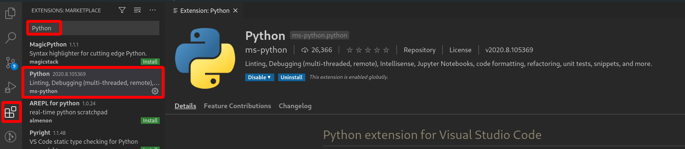
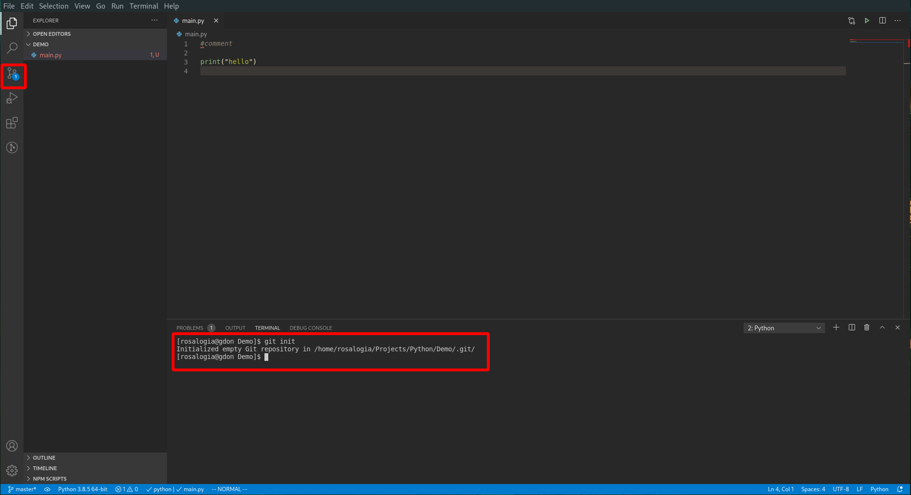
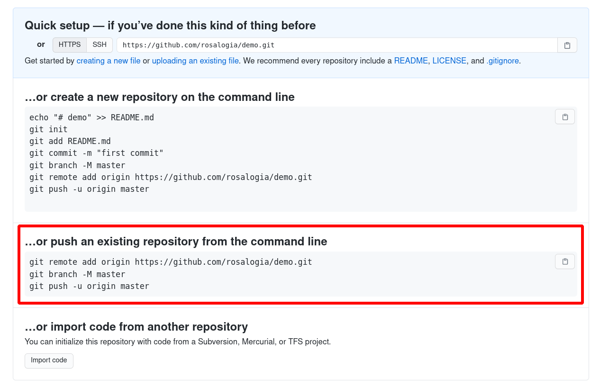
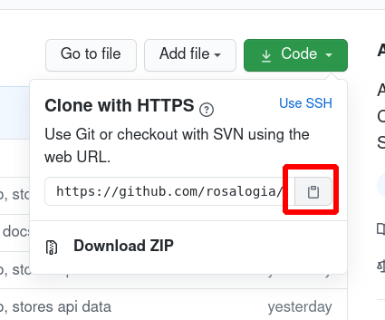
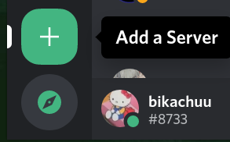

# Setting Up Your Environment

RUCS24-Bot is a Discord bot written in Python. To begin working on its development, you're going to need five things in particular:

* Python 3.8 installed
* A text editor to write Python in
* `git`, a popular version control tool
* [discord.py](https://discordpy.readthedocs.io/en/latest/), the standard Python discord library
* Your own discord bot application registered with Discord to test your additions with

In this **comprehensive** guide we're going to describe the steps you'll need to take to set up all of these things and begin contributing to our bot.

Note that this guide is in fact **comprehensive**, more so than any seasoned programmer will need it to be. That is because it is for beginners who have only ever programmed in personal or academic environments. If you already feel comfortable with one of the tools listed above, feel free to use the following table to skip to whichever ones are still relatively new to you.

#### Table of Contents

* [Installing Python](#installing-python)
* [Text Editor](#text-editor)
* [Installing and Using Git](#installing-and-using-git)
* [Setting Up a Testing Environment for RUCS24-Bot](#Setting-Up-a-Testing-Environment-for-RUCS24-Bot)
## Installing Python

Python is an interpreted programming language, so we need to install the Python interpreter, as well as the set of tools it usually comes packaged with. Unless you're on a popular distribution of Linux, you should find, download and install Python 3.8.5 or newer from [this webpage](https://www.python.org/downloads/). When running the installer, make sure you select the option to add Python to your PATH. This is crucial for running your Discord bot. If you fail to perform this step, you can always [fix it](https://datatofish.com/add-python-to-windows-path/) later, so don't get anxious.

If you're running a popular distribution of Linux, particularly one that isn't commonly used for LTS servers like CentOS, it is unlikely that you will need to install Python through the Python website. Instead, you probably can and _should_ install Python through your distribution's package manager. Here are some instructions for some popular Linux distributions

### Ubuntu

```
$ sudo apt-get install software-properties-common
$ sudo add-apt-repository ppa:deadsnakes/ppa
$ sudo apt-get update
$ sudo apt-get install python3.8
```

### Fedora

```
$ sudo dnf install python38
```

### Arch Linux

```
$ sudo pacman -S python
```

Note that depending on your distribution, the Python command in your path may point to different versions of Python. You may need to use a command like `python3.8` or `python3` instead of `python` when running the bot.

## Text Editor

**IMPORTANT**: Read the [Note on Privacy & Visual Studio Codium](#note-on-privacy-and-visual-studio-codium) before choosing to install Visual Studio Code.

There is no text editor that is decidedly or objectively the best for your or our purposes. We can only make a recommendation based on what's currently viable, popular, convenient and user-friendly. As you become a more experienced programmer, consider taking the time to familiarise yourself and experiment with various tools for programmers and carefully weigh and evaluate them to choose which one works best for you.

We're going to suggest Visual Studio Code because it's free, open source, popular [which means there are lots of people on the internet asking and answering questions about how to use it or solve its common problems], and has lots of support for writing Python conveniently. It's also a professionally used tool, rather than an environment you will have to leave behind when you are past the "learner" stage.

You can learn more about Visual Studio Code and download it [here](https://code.visualstudio.com/). Unless you are using a non-debian based or non-fedora based Linux distribution, you should be able to conveniently download and install VS Code from this link. However, if you are using another distribution, like Arch Linux, you should install it through your package manager, or download the provided tarball and extract it.

After installing VS Code, you should install the Python extension:


You can verify that your installation of Python, VS Code, and the Python extension are all working as expected by creating a simple demo project in a folder of your choosing.

In the VS Code `File` menu, select Open Folder (or if you prefer to learn Keyboard Shortcuts, press `Control + K` followed by `Control + O`, you can even keep the Control key held down between both of them if you'd like) and select or create a folder that you want your demo project to live in.

Once you select a folder, VS Code will create a workspace there. Click on the New File icon located on the left-hand side of your workspace (or, press `Control+Shift+P` and type in `new file` and hit enter) and name it `main.py`.

The file you created should open up on the right-hand side of your workspace. Begin typing in some code, like ...

```python
print("Hello")
```

If everything is going well, you should see the editor begin to suggest (or "auto-complete") common or predicted completions for the code you're in the process of typing out. This feature is incredibly useful, and if you haven't already been taking advantage of it, you should definitely get comfortable with it.

Once you have saved your `main.py` file, create a terminal within VS Code by clicking on the `Terminal` menu at the top of the window and selecting `New Terminal` or with the keyboard shortcut Control+Shift+`.

In the terminal, type in `python main.py` to run the program. If this does not work, try variations like `python3 main.py`, `py main.py` or `python38 main.py`, as different operating systems may refer to the Python 3.8.5 interpreter differently. If this doesn't work, it may be the case that Python was not successfully added to your PATH. Check the instructions linked above to resolve this issue.

### Additional Set Up

#### Linting

A "linter" in software development is a tool that analyses your code for bad style. Code should be consistent and readable. Many open source projects enforce a style guide, and so do many professional spaces. Some projects and companies have their own standards for code style, but RUCS24-Bot adheres strictly to the standard set of style guidelines for Python, known as [PEP 8](https://www.python.org/dev/peps/pep-0008/).

Obviously, you're not expected to learn and memorise PEP 8 in order to contribute. Most programmers install a linter, like [flake8](https://pypi.org/project/flake8/), so that their text editor can tell them when they're writing code that doesn't conform to the style guide. Additionally, there are tools like [Black](https://pypi.org/project/black/) that you can install and run on all of your code to automatically reformat it according to official style guidelines.

Consider installing `flake8` and setting up VS Code to use it like so:

1. Run `pip install flake8` or `pip3 install flake8` in a terminal.
	- You can open one up right where you are in VS Code by clicking on the `Terminal` menu at the top of VS Code and selecting `New Terminal` or pressing Control+Shift+`
2. Navigate to `File > Preferences > Settings` or press `Control + Comma` to open up your settings, and search for "flake8"
3. Make sure the following checkbox is ticked: 

To test that it is properly working, try creating a comment like this in your code:

```python
#Improperly formatted comment
```

Then save your file. You should see a squiggle appear under your comment, and hovering over it should display a window describing the problem.

### Note on Privacy and Visual Studio Codium

Visual Studio Code is an open source text editor developed by Microsoft, however it is commonly known and acknowledged that the version of VS Code that is distributed on the link above includes software that collects and tracks information about your computer usage and sends it to Microsoft for analysis. This is known as "telemetry." Some users are, rightfully, uncomfortable with this and are unwilling to use a text editor that violates your privacy to the degree that VS Code does.

However, this problem only exists with the version of VS Code that Microsoft distributes on their website. The problem can be circumvented entirely by downloading and compiling the VS Code source-code. Compiling a large program from source can take a lot of time and can be confusing to new programmers, so a group of people have pre-compiled VS Code without the telemetry features, and are distributing it as [Visual Studio Codium](https://vscodium.com/).

There are no downsides to using this version of VS Code, and it is recommended that you do if you care about your privacy and are uncomfortable with a large corporation receiving data about how you use your computer and its tools. The link above includes more information on the Codium project as well as installation instructions for various operating systems.

## Installing and Using Git

`git` is the name of a software package whose explicit purpose is "version control." Version control is the process of keeping track of the changes made to a set of files or documents over a long period of time, such that if there's ever anything wrong with the current version of those files/documents, you will be able to see which particular change caused the problem, and "go back in time" to a version where the problem didn't exist.

Programmers need this often for shared projects. Sometimes someone will make a change to the codebase that can cause major problems, or might accidentally delete a large portion of the code. How should this be dealt with? The best approach is a version control system that keeps track of ...

* Who is making a change
* Why they're making it
*  How to undo that change if necessary

`git` does all three of these things, and is the most popular version control system for open source software development. In an open source project, several hundreds or even thousands of unique individuals might be responsible for contributing to the codebase, and this leaves lots of room for accidents and mistakes. Using a reliable version control system, as well as backing up the project on a server, helps mitigate any of the easier-to-trigger catastrophes.

A guide for installing `git` is available [here](https://git-scm.com/book/en/v2/Getting-Started-Installing-Git). 

Note that `git` and GitHub are two separate but [unofficially] related things. While neither one has control or ownership over the other, `git` is a tool that you install and use locally, and GitHub is a website for hosting, viewing, contributing to and managing `git` _repositories_, which are essentially project folders that are version controlled by `git`.

This means that you can [and should] use `git` even if your project is not uploaded to GitHub. `git` is extremely useful even if you are the only person developing your project. It helps you be organised and stops you from making mistakes that might end up wasting a lot of your time.

Let's try using `git` with the Demo project we made earlier. Once you've installed `git`, you should be able to use it from within a terminal you create in VS Code. In your Demo folder, run the command `git init` to turn your folder into a `git` repository. You should see VS Code responding to this. Particularly, the _source control_ icon should now have a little 1 next to it, indicating that 1 modification has been detected in the source of the project.



When using `git`, you are in control of which files should be version controlled and which files can safely be ignored by git. Some files have no reason to be version controlled. For example, your personal configuration file for the RUCS24-Bot should never be version controlled, as it should contain the token [essentially the username and password] for your bot account. Because of this, we have created a file in RUCS24-Bot's repository called `.gitignore`, which `git` automatically detects and reads to find out which files should never be version controlled. However, this works no differently than simply remembering to never add a certain file to version control. It is simply more convenient.

Let's tell `git` to track and version control our `main.py` file. There are two ways you can do this. The first is to use the `Stage Changes` button (a + symbol) in the VS Code source control panel, type in a "commit message" which describes the change you made, and then press Ctrl+Enter in the "commit message" box to finalise your changes. However, keep in mind that even "finalised" changes can be reverted because `git` version controls your files. 

The second way to go about this is through the command line: you can type in `git add main.py` to "stage" your changes, and `git commit -m "Your commit message"` to finalise those changes.

`git` has tons of subcommands capable of all sorts of complex behaviours, and as a programmer you should strive to learn more of them. Sometimes you will make mistakes with `git` that will freak you out or make you break into a sweat, or otherwise frustrate you. Be patient with yourself, and practice your ability to find solutions on the internet. There usually will be one waiting for the most patient individual.

### Using GitHub

GitHub is an online platform for hosting, viewing, contributing to and managing `git` repositories. RUCS24-Bot is hosted and managed on GitHub, and to contribute to it you will need a GitHub account. We will briefly go over how to use `git` when working in a repository hosted on GitHub.

1. Create a GitHub account at [github.com](https://github.com/)
2. Click on the + button at the top right and select "New repository"
3. Name the repository "demo" and click "create repository"
	- Do NOT check any of the boxes above the "create repository" button

You should be met with some potentially daunting instructions. These are the ones we need:



You should be able to paste in every command listed to your terminal and face few to no problems. However, we should understand what's going on, even if only at the surface level.

`git remote add origin ...` is a command that adds a `git` "remote" called "origin". A remote is a server, a computer other than yours that yours connects to in order to send and receive data, that hosts a git repository. `git` allows you to add remote hosts that you can send the contents of your local `git` repository to. GitHub exists primarily to be a remote host for `git` repositories, so this makes sense.

`git branch -M master` is a safety measure. GitHub requires that the "main" branch of your `git` project is called "master". This command forcefully renames the current branch to master, in case you have renamed it for any reason.

`git push -u origin master` is the command that "pushes" i.e. uploads all of your local commits to the "master" branch of the "origin" remote. From this point on, you can push future commits with the command `git push` rather than typing out the whole `git push -u origin master`. However, you should know that `git push` will _only_ upload changes that have been committed. If you have local changes that you have not staged and committed, `git push` will not upload them. You can experiment with this as much as you would like.

Remember that the basic workflow for adding to a `git` repository is the following:

1. Make changes
2. `git add` the changed files
3. `git commit -m "A message mentioning the changes you made"`
4. `git push`

Experiment with repeating this process with simple little changes to your `main.py` file in your Demo project as many times as you need to to get used to it.

## Setting Up a Testing Environment for RUCS24-Bot

[discord.py](https://discordpy.readthedocs.io/en/latest/) is the most popular Python library for developing Discord applications. In this step of the guide, we will first make a "fork" of the RUCS24-Bot repository, make our own Discord bot account so that we can test it out, and finally we will install [discord.py](https://discordpy.readthedocs.io/en/latest/) and run the RUCS24-Bot for testing purposes in our own private testing server. From here, you will be ready to make changes and additions to RUCS24-Bot that might eventually be merged into the version that runs in the RUCS24 server.

### Forking and Cloning RUCS24-Bot

#### Forking

A "fork" of an open source software project is a clone of it that is maintained and developed by a person other than the original creator. Forks enable a handful of community behaviours from the get-go. For example, if a person is unhappy with the direction in which an open source project is heading, they can fork the project at a commit where they were happy with it, and continue developing or using it in the direction they prefer. Another reason to fork a repository might be that the original creator is no longer interested or capable of maintaining and growing the project, so a more enthusiastic contributor might fork it and theirs might become the more popular and regularly updated version of the project.

There is a much more common reason to fork a project on GitHub, however. When a person who isn't close friends or associates with the creator of a GitHub repository wants to contribute to that repository, they need a way to edit and suggest changes to the repository that the original maintainer can accept or reject. The most popular way to do this is by having the contributor fork the main project, make the changes they want to see, then make a "Pull Request" to the main/original repository. A Pull Request is a request on the behalf of the contributor to have the changes on their fork of a project "merged" into the main project by the main project's maintainer.

If all of this is confusing, consider reading [this guide](https://www.dataschool.io/how-to-contribute-on-github/) that explains all of the above in much greater detail with screenshot examples.

Navigate to the [RUCS24-Bot repository](https://github.com/rosalogia/rucs24-bot) and click on the "Fork" button at the top right corner underneath the + symbol you used to create a new repository earlier. This will create a forked repository under your account called `rucs24-bot` that you can make changes to as you'd like. Note, however, that messy and unwanted changes will need to be removed before any Pull Requests are made.

#### Cloning

Open a terminal, either externally or through VS Code, and navigate to a folder that you want to contain your Python projects. On most operating systems, you can navigate to a specific folder with the command `cd` followed by the proper file path.

On Linux or Mac you might do `cd ~/Projects/Python/` if you have already created the `Projects` folder and the `Python` folder underneath of that.

On Windows, you might do `cd C:\Projects\Python\` if you have already created those same folders.

If you want to create those folders from the command line, you can use the `mkdir` command.

For example, `mkdir ~/Projects` followed by `mkdir ~/Projects/Python` on Linux or Mac, and `mkdir C:\Projects` followed by `mkdir C:\Projects\Python` on Windows.

Once you have navigated to your preferred folder for storing Python projects in your terminal, navigate to your fork of the RUCS24-Bot repository and click on the green "Code" button and click on the clipboard that appears next to the HTTPS URL as shown here:



Back in your terminal, now in the directory where you wish to store your Python projects, run the command `git clone <repository_url>` where `<repository_url>` is replaced by whatever you have copied from the GitHub repository.

For me this looks like `git clone https://github.com/rosalogia/rucs24-bot.git`.

Once this command finishes running, you should find that a new folder has been created inside the folder your currently in. This folder contains the code for your fork of the RUCS24-Bot, and it is yours to make changes and additions to. Make sure you open this folder up in VS Code before the next step.

### Installing [discord.py](https://discordpy.readthedocs.io/en/latest/) and Creating a Bot Account

The Python package manager `pip`, or on some computers, `pip3` is what we use to install libraries and packages to be used in our Python code. You can use it either by manually specifying a package you would like to install, like so:

`pip install discord.py`

Otherwise, if you have a `requirements.txt` file available that lists all the packages required by a project, you can have `pip` read from that file and install all the packages listed inside of it. RUCS24-Bot has one of these, so from the terminal in your project folder, run `pip install -r requirements.txt`. 

The library is now installed, but we can't actually run RUCS24-Bot yet. Discord bots are actual accounts that can be invited to servers and interact with the users in a server, but are managed with more restrictions than normal user accounts in order to limit potential exploitation. Nonetheless, any Discord bot that you intend to run will have to have its account created and registered through Discord. After doing this, Discord will give us its "token," essentially its username and password encoded in one long string, that we can provide to [discord.py](https://discordpy.readthedocs.io/en/latest/) in order to have it log in with our bot's account.

To create a bot account ...
1. Navigate to the [Discord Developer Portal](https://discord.com/developers)
2. Select "New Application" in the top right and give it a name of your choosing
3. Select the "Bot" menu on the left hand side of the screen
4. Click "Add Bot" on the right-hand side of the screen and confirm that you would like to do this when asked
5. Find the "Token" section and click "Copy"
	- Note: if by chance your token accidentally gets leaked, immediately navigate to this page again and click the "Regenerate" button that you see next to the "Copy" button. This will stop anyone who has come across your bot's token from logging in with it and doing potentially destructive things in the servers you've invited your bot to.

Now that you have the bot's token copied, you have to create a `config.json` file that RUCS24-Bot can look into in order to find the bot's token and log in with it. Create a new file in the project folder with VS Code called `config.json` that looks like this

```json
{
	"botToken" : "PASTE_YOUR_TOKEN_BETWEEN_QUOTES_HERE"
}
```

We are getting closer and closer to having a fully running version of the RUCS24-Bot that you can play with and test while developing it further. There are a few more important steps.

Firstly, you should create an empty Discord server of your own that you can invite your bot account to.



Now we will invite the bot to the server. Return to the page on [discord.com](https://discord.com/developers) where you created your bot. On the left-hand side, select "General Information" and find the section labelled "Client ID".

In order to invite your bot to your server, you must create a special link that incorporates its client id that looks like this:

https://discord.com/api/oauth2/authorize?client_id=YOUR_CLIENT_ID_GOES_HERE&scope=bot&permissions=8

This link will not work until you replace the capitalised text with your bot's client id. Once you do replace the text and navigate to the link, you will be prompted to select which server [of those in which you are an administrator] you would like to invite the bot to. Select the one you recently created.

You should find that your bot account has popped up in your server, but that it is offline. We are one step away from fixing this.

Return to your terminal in VS Code and, finally, run `python main.py`. You should find that your bot begins to run after a few seconds, and that your bot account is online. You can test it out with the `!help` command, which will show you how to access its other features.

## Conclusion

Congratulations on making it through this guide! It is entirely too long, but it is _comprehensive_. Hopefully those who were looking for such a comprehensive guide are satisfied by this one.

If you are impatient (which isn't bad; enthusiasm is good), you may begin messing with the bot's code right away by accessing the [Cog Quickstart](https://github.com/rosalogia/rucs24-bot/CONTRIBUTING.md#cog-quickstart) in the contribution guide and following along, then editing it to your pleasure. You may also observe and tinker with other existing cogs to understand how they work and how the library works in general. You can explore the library further and read about how it works at its [official documentation](https://discordpy.readthedocs.io/en/latest/#documentation-contents) webpage.

We hope you will enjoy working on RUCS24-Bot, learn valuable skills while doing so, and that you will never have to read anything of this length to get up and running with an open source project ever again. A lot of this information will transfer over to other projects, so try not to consider it time wasted! Your time and attention is much appreciated, and so are your contributions to RUCS24-Bot.
